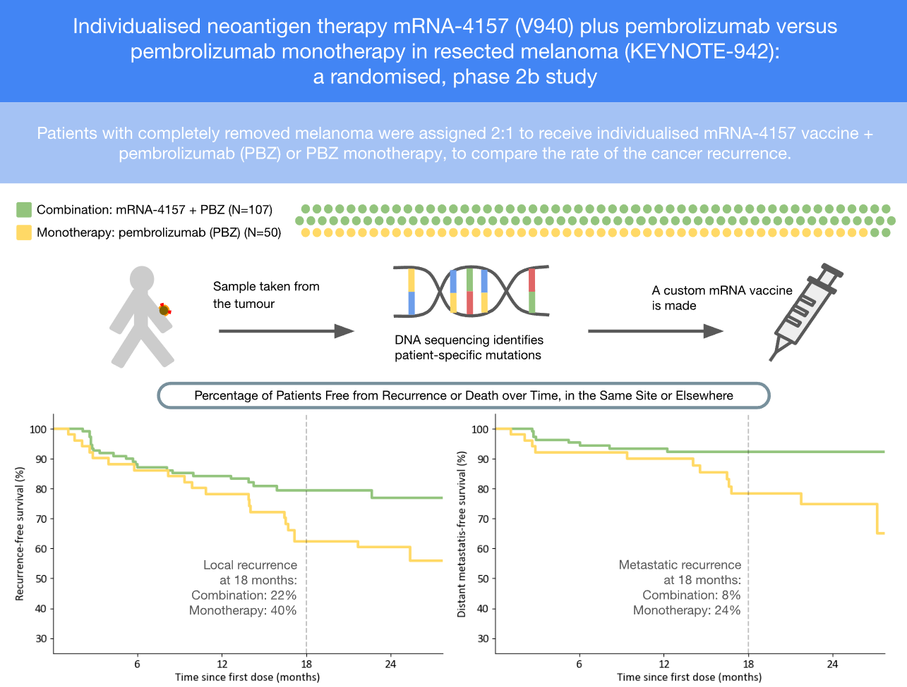
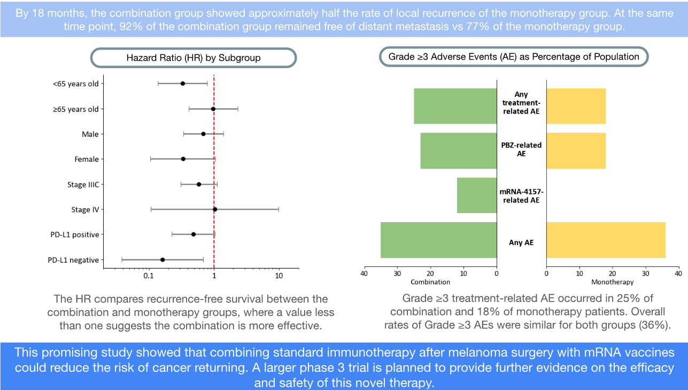

# Medical Journal - Graphical Abstract
### A Visual Summary for the Lancet

A Graphical Abstract for the Lancet paper:
Individualised neoantigen therapy mRNA-4157 (V940) plus pembrolizumab versus pembrolizumab monotherapy in resected melanoma (KEYNOTE-942): a randomised, phase 2b study

### The Science
**Cancer & vaccines.**
For decades scientists have been trying to use vaccination to train the immune system to better recognise and fight cancer cells. However, studies trialling tumour-associated antigen vaccines have been ineffective or even detrimental. Antigens exposed on the surface of cancer cells - you can think of these like the TV aerials on the roof of a house; a small component of a larger whole - offer potential targets for cancer therapies. The problem is that due to the mutation inherent in cancer, they’re unique for every patient.

**RNA vaccine mechanism.**
Vaccines utilising mRNA work by delivering to our healthy cells the genetic blueprint for making some protein characteristic of our target (e.g. our antigens). Our cells can then naturally produce those proteins - priming our immune response. This genetic material is much more flexible to develop; making these vaccines more adaptable.

**Technically prohibitive, until now.**
Recent advances have gradually overcome the barriers to enabling this. Pfizer-BioNTech and Moderna's COVID-19 vaccines were the first mRNA vaccines to be approved and widely distributed. Nanotechnology developed lipid nanoparticles - protective bubbles that allowed mRNA to reach the cells without being degraded. And crucially for cancer, next-generation sequencing (NGS) allows us to quickly get a DNA profile of patient-specific mutations. 

**What makes this study important.**
This trial combines the insight of NGS with the adaptability of RNA to provide patients with vaccines specific to their tumours. Upcoming phase three trials will be able to conclude on the their usefulness, but these results present a strong early case for their efficacy. 
[Link to the RNA Lancet article](https://www.thelancet.com/journals/lancet/article/PIIS0140-6736(23)02268-7/abstract "The Lancet")
(note there is a pay wall to access the full paper but the abstract is freely available).

### The Format
**What is a graphical abstract?**
A graphical abstract is a relatively new practice within scientific publishing that aims to communicate the purpose and results of a research paper through clear and concise visual summaries. Thus increasing accessibility and accommodating a wider audience.

### The Project
**Skills on show**
- Clear communication of qualitative results in an accessible way. 
- Creating summarising visualisations using Python and matplotlib in Jupyter Notebook.
- Showcases confidence in working with complex scientific material.
- Learning and applying industry best-practices in format and design.